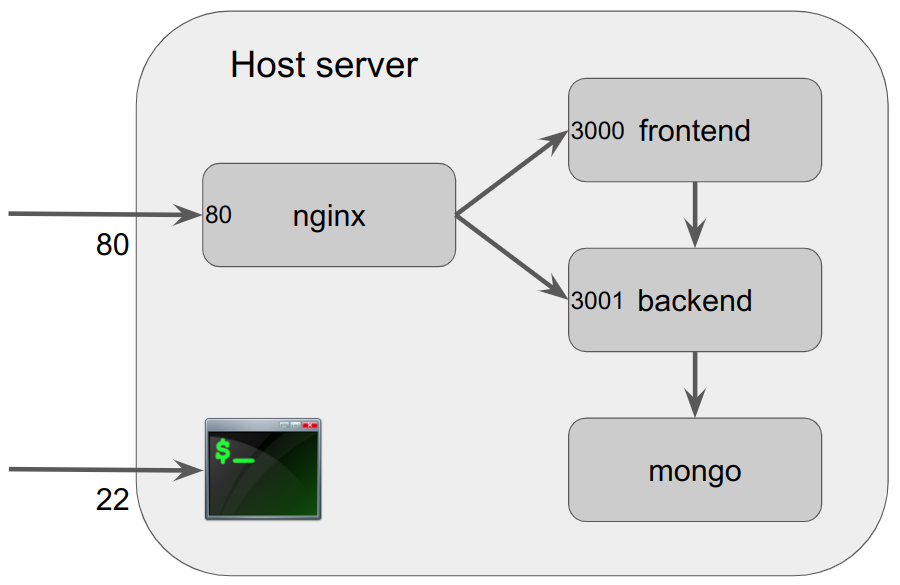

# WayCarbon Challenge - DevOps #

- [Introduction](#introduction)
- [The Challenge](#the-challenge)
- [The Project](#the-project)
  - [The Structure](#the-structure)
  - [The Details](#the-details)
  - [Showcase](#showcase)
- [Operating Instructions](#operating-instructions)
  - [Installing the Tools](#installing-the-tools)
  - [Getting the Repository](#getting-the-repository)
  - [Configuring the Project](#configuring-the-project)
  - [Building the Images](#building-the-images)
  - [Pushing the Images to the Repositories](#pushing-the-Images-to-the-Repositories)
  - [Provisioning the Infrastructure](#provisioning-the-infrastructure)
  - [Deploying the Project](#deploying-the-project)
- [Known issues](#known-issues)
- [Special Notes](#special-notes)
- [Contact Information](#contact-information)

## Introduction ##

This repository contains a solution for a DevOps challenge proposed in 01/06/23 by the [WayCarbon](https://waycarbon.com/) company.

## The Challenge ##

The full description of the challenge can be find [here](doc/waycarbon-challenge.pdf).

In summary, the challenge is to provision a cloud environment for a web application that consists of a frontend component and a backend component, using one or more Docker containers. The components should be served on the same domain but with different paths. The frontend and backend need to form a cohesive application, with one depending on the other.

## The Project ##

### The Structure ###

This project consists of 4 services deployed in Docker containers. There is a web app (frontend) that communicates with an API (backend), which in turn reads/writes data to a database (mongo). These services are accessed through a web server (nginx).

The project structure is shown following: 



### The Details ###

The project started based on the repository [knaopel/docker-frontend-backend-db](https://github.com/knaopel/docker-frontend-backend-db), which has a simple application with a frontend, a backend, and a MongoDB database. In this system, an Nginx web server was added to control the reverse proxy for the frontend and the backend.

The [Amazon Elastic Computer Cloud (Amazon EC2)](https://aws.amazon.com/ec2/), and the [Docker Hub container registry](https://hub.docker.com/), as well as the Ansible, Docker, and Terraform tools were chosen for convenience, but other equivalent environments and tools could have been adopted.

To simulate a domain name, the website [Dynu](https://www.dynu.com/) was used as a dynamic DNS server, allowing the use of the name `waycarbon-challenge.freeddns.org` for the server. To facilitate the creation of new servers and the need for IP updates, an auxiliary script was created (see the section [Provisioning the Infrastructure](#provisioning-the-infrastructure)).

### Showcase ###

The project can be seen in all its glory at:

- Frontend: http://waycarbon-challenge.freeddns.org/
- Backend: http://waycarbon-challenge.freeddns.org/api

## Operating Instructions ##

### Installing the Tools ###

To use all the commands and scripts listed here, you need to install and configure the following tools:

- [Ansible](https://docs.ansible.com/ansible/latest/installation_guide/intro_installation.html);
- [AWS CLI](https://docs.aws.amazon.com/cli/latest/userguide/getting-started-install.html);
- [Docker](https://docs.docker.com/engine/install);
- [Git](https://git-scm.com/book/en/v2/Getting-Started-Installing-Git);
- [Terraform CLI](https://developer.hashicorp.com/terraform/tutorials/aws-get-started/install-cli).

### Getting the Repository ###

To clone the repository, execute the following:

```bash
$ git clone https://github.com/marceloavilaoliveira/waycarbon-challenge.git
```

These are the repository contents:

```
.
|-- backend/           => Backend component of the web app
|-- frontend/          => Frontend component of the web app
|-- nginx/             => Nginx configuration
|-- data/              => Mongo DB data (ignored by Git)
|-- bash/              => Bash scripts
|-- ansible/           => Ansible playbooks
|-- terraform/         => Terraform infrastructure definition
|-- doc/               => Documentation
|-- docker-compose.yml => Docker compose file
|-- .env               => Environment definition file
|-- .dockerignore      => Docker ignored files/directories
|-- .gitignore         => Git ignored files/directories
`-- README.md          => This file
```

### Configuring the Project ###

To configure the project, create a `.env` file at the root of the repository, defining the following variables:

```
DOCKER_HUB_USER="<docker-hub-username>"
PUBLIC_KEY="<ssh_public_key>"
```

#### DOCKER_HUB_USER ####

This variable defines the Docker Hub username that will be used to create the image repositories and to push/pull the images to/from. The frontend and backend images are pushed/pulled to/from `$DOCKER_HUB_USER/waycarbon-challenge-frontend` and `$DOCKER_HUB_USER/waycarbon-challenge-backend` repositories on Docker Hub. The respective Docker Hub password will be asked by the `bash/push.sh` script.

#### PUBLIC_KEY ####

This variable defines the SSH public key that will be used to provision the AWS infrastructure. Ansible will use the respective SSH private key to access the machine.

### Building the Images ###

To build the Docker images for both the frontend and the backend execute the following:

```bash
$ bash/build.sh
```

If you need to build just a specific component, you can specify it using the -c flag:

```bash
$ bash/build.sh -c frontend|backend
```

### Pushing the Images to the Repositories ###

To push the Docker images to Docker Hub repository for both the frontend and the backend execute the following:

```bash
$ bash/push.sh
```

If you need to push just a specific component, you can specify it using the -c flag:

```bash
$ bash/build.sh -c frontend|backend
```

The images are pushed to the `$DOCKER_HUB_USER/waycarbon-challenge-frontend` and `$DOCKER_HUB_USER/waycarbon-challenge-backend` repositories on Docker Hub. If these repositories do not exist, the build script will create them. In that case, it requires the Docker Hub password. You can set the following environment variable:

```bash
$ export DOCKER_HUB_PASS=<docker-hub-password>
```

Or you can just answer to the script when it was prompt.

### Provisioning the Infrastructure ###

To provision the AWS infrastructure execute the following:

```bash
$ bash/provision.sh
```

If you create a new server for the project, then it is necessary to update the server's IP on the Dynu website. To update the IP, get the server's IP in AWS and execute the following:

```bash
$ bash/update-ip.sh -i <server_ip>
```

### Deploying the Project ###

To deploy the project in AWS execute the following:

```bash
$ cd ansible
$ ansible-playbook deploy.yaml
```

## Known issues ##

- The backend needs to be served by an orchestration service (see [issue #1](https://github.com/marceloavilaoliveira/waycarbon-challenge/issues/1));

- The frontend needs to be delivered by a Content Delivery Network (CDN) (see [issue #2](https://github.com/marceloavilaoliveira/waycarbon-challenge/issues/2)).

## Special Notes ##

- The application data is stored in the `data` directory. It would be more convenient for them to be stored in an independent volume, making backups easier.

- For simplicity, it was chosen to use public repositories on Git Hub and Docker Hub, therefore facilitating the deployment of the project without the need to keep credentials in Ansible Vault.

## Contact Information ##

Author: **Marcelo Ávila de Oliveira**

- E-mail: [marceloavilaoliveira@gmail.com](marceloavilaoliveira@gmail.com)
- LinkedIn: [https://www.linkedin.com/in/marceloavilaoliveira](https://www.linkedin.com/in/marceloavilaoliveira)
- StackOverflow: [https://stackoverflow.com/users/4653675](https://stackoverflow.com/users/4653675)
- GitHub: [https://github.com/marceloavilaoliveira](https://github.com/marceloavilaoliveira)
